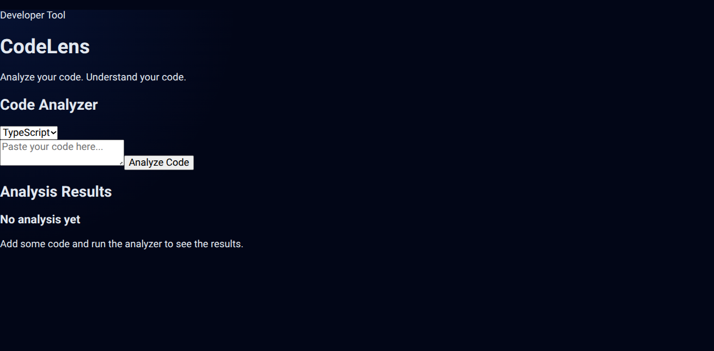

# CodeLens

### Static Code Analysis Tool for JavaScript & TypeScript

CodeLens is a developer tool built with React and TypeScript that allows users to paste JavaScript or TypeScript code and analyze it through static code analysis.

The project combines **AST-based code analysis** with an additional **AI-powered analysis layer** to provide information about code quality, complexity, potential issues, and possible improvements.

The main goal of the project was to practice building a more technical React application while exploring **static analysis, the TypeScript Compiler API, API integration, and serverless functions**.

---

## 🌐 Project Links

[](https://codelens-sepia-eight.vercel.app/)
[](https://github.com/JeanRibeiro8/codelens)

---

## 📸 Preview

<div align="center">



</div>

---

## 📌 About

CodeLens was created as a practical study project focused on understanding how developer tools can inspect source code programmatically.

Instead of relying only on an AI service, the project performs its core analysis locally using the **TypeScript Compiler API**.

The application parses the source code, traverses its **Abstract Syntax Tree (AST)**, extracts metrics, identifies potential issues, and generates suggestions.

An additional AI analysis layer can then use the source code together with the static analysis results to provide explanations and recommendations.

---

## ✨ Features

* Paste JavaScript or TypeScript code for analysis
* Static source-code analysis
* AST-based code parsing
* Code quality score
* Lines of code analysis
* Function detection
* Variable detection
* Condition detection
* Cyclomatic complexity analysis
* Potential issue detection
* Issue severity classification
* Improvement suggestions
* AI-assisted code analysis
* Explanations and recommendations generated from analysis results
* React-based interface
* Serverless API integration

---

## ⚙️ How It Works

The analysis process can be represented as:

```text
User Code
    ↓
CodeLens Interface
    ↓
TypeScript Compiler API
    ↓
AST Parsing
    ↓
Static Analysis
    ↓
Metrics + Issues + Suggestions
    ↓
AI Analysis
    ↓
Explanations + Recommendations
```

The static analysis is the foundation of the application, while AI works as an additional layer on top of the generated analysis data.

---

## 🔍 Static Analysis

CodeLens uses the **TypeScript Compiler API** to parse JavaScript and TypeScript source code.

The source code is converted into an **Abstract Syntax Tree (AST)**, which allows the application to inspect the structure of the code programmatically.

The analyzer traverses the AST to identify different types of information, including:

* Functions
* Variables
* Conditional statements
* Source-code structure
* Potential complexity
* Possible code issues

This approach makes it possible to analyze the structure of the code rather than simply treating it as plain text.

---

## 📊 Metrics

CodeLens extracts several metrics from the analyzed source code.

| Metric                | Description                                        |
| --------------------- | -------------------------------------------------- |
| Code Quality          | Overall quality score generated from the analysis  |
| Lines                 | Number of lines in the analyzed source             |
| Functions             | Number of functions detected                       |
| Variables             | Number of variables detected                       |
| Conditions            | Number of conditional structures detected          |
| Cyclomatic Complexity | Measures the number of independent execution paths |

These metrics help provide a quick overview of the structure and complexity of the analyzed code.

---

## ⚠️ Issue Detection

The static analyzer can identify potential issues in the source code and organize them according to their severity.

Issues can be presented with different severity levels, allowing developers to quickly understand which parts of the code may require attention.

CodeLens also generates improvement suggestions based on the detected problems.

The purpose of this system is not only to identify an issue, but also to provide context about what could potentially be improved.

---

## 🤖 AI Analysis

CodeLens includes an additional AI analysis layer.

The application sends the source code together with the static analysis results to a backend endpoint.

The AI can then provide:

* Explanations of detected issues
* Additional recommendations
* Code improvement suggestions
* Context around the static analysis results

The AI layer is designed to **complement the static analyzer rather than replace it**.

The core analysis is based on the application's own AST-based analysis.

---

## 🏗️ Architecture

The project separates the main responsibilities into different areas.

### Frontend

The React application is responsible for:

* User interaction
* Code input
* Displaying analysis results
* Presenting metrics
* Showing detected issues
* Displaying AI recommendations

### Static Analyzer

The analyzer is responsible for:

* Parsing source code
* Traversing the AST
* Extracting metrics
* Detecting potential issues
* Generating suggestions

### API

The serverless API endpoint handles the communication between the frontend and the AI service.

This keeps the AI request logic separated from the main React interface.

---

## 🧰 Tech Stack

| Technology                  | Purpose                                |
| --------------------------- | -------------------------------------- |
| React                       | User interface                         |
| TypeScript                  | Application and analyzer development   |
| Vite                        | Development environment and build tool |
| TypeScript Compiler API     | Source-code parsing and AST analysis   |
| OpenAI API                  | AI-assisted code analysis              |
| Vercel Serverless Functions | Backend API endpoint                   |
| CSS                         | Interface styling                      |
| Git & GitHub                | Version control                        |

---

## 📂 Project Structure

```text
codelens/
├── api/
│   └── analyze.ts
│
├── src/
│   ├── analyzer/
│   │   ├── analyze.ts
│   │   ├── parser.ts
│   │   ├── quality.ts
│   │   ├── suggestions.ts
│   │   └── types.ts
│   │
│   ├── App.tsx
│   ├── App.css
│   └── index.css
│
├── package.json
├── tsconfig.json
└── vite.config.ts
```

The `analyzer` directory contains the main static-analysis logic, while the `api` directory contains the serverless endpoint used for AI analysis.

---

## 🧠 What I Practiced

Building CodeLens allowed me to work with concepts beyond a typical frontend interface.

### React & TypeScript

* React component development
* TypeScript types and interfaces
* Application state
* Structuring a React application

### Static Code Analysis

* Source-code parsing
* Abstract Syntax Trees
* AST traversal
* Code metrics
* Complexity analysis
* Issue detection

### API Integration

* Frontend-to-backend communication
* API requests
* Serverless functions
* Handling external AI services

### Developer Tool Concepts

* Code inspection
* Quality metrics
* Automated suggestions
* Separating analysis logic from UI logic

---

## 🚀 Getting Started

### 1. Clone the repository

```bash
git clone https://github.com/JeanRibeiro8/codelens.git
```

### 2. Navigate to the project

```bash
cd codelens
```

### 3. Install dependencies

```bash
npm install
```

### 4. Configure environment variables

If the AI analysis is enabled, configure the required API environment variable in your local environment.

Do not expose private API keys directly in frontend code.

### 5. Start the development server

```bash
npm run dev
```

The application will be available through the local Vite development server.

---

## 🌍 Deployment

The project is deployed with **Vercel**.

The frontend is served as a Vite application, while the AI analysis endpoint is handled through a Vercel Serverless Function.

### Live Application

https://codelens-sepia-eight.vercel.app/

---

## 🔮 Future Improvements

Possible future improvements include:

* More advanced static analysis rules
* Additional code-quality metrics
* Support for more analysis patterns
* More detailed issue explanations
* Improved AI recommendations
* Additional language support
* More advanced code visualization

These are potential improvements and are not part of the current implementation.

---

## 🎯 Project Purpose

CodeLens was created as a portfolio and learning project to demonstrate practical experience with:

* React
* TypeScript
* Static code analysis
* AST-based programming
* API integration
* Serverless functions
* AI-assisted developer tools

The project represents an exploration of how frontend applications can interact with more technical programming concepts beyond traditional UI development.

---

## 👨‍💻 Author

**Jean Ribeiro**

Junior Frontend Developer focused on building modern web applications with React and TypeScript.

* GitHub: [JeanRibeiro8](https://github.com/JeanRibeiro8)
* LinkedIn: [Jean Ribeiro](https://www.linkedin.com/in/jean-ribeiro-9a3792267/)
* Portfolio: [jeanribeiro8.github.io/JeanRibeiro](https://jeanribeiro8.github.io/JeanRibeiro/)
* Email: [jeanrsantos10@gmail.com](mailto:jeanrsantos10@gmail.com)

---

<div align="center">

**Built to explore static analysis, React, TypeScript, and AI-assisted developer tools.**

</div>
